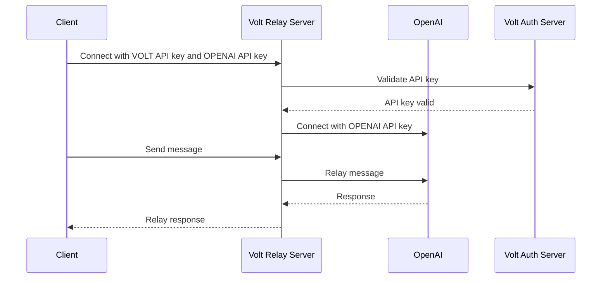
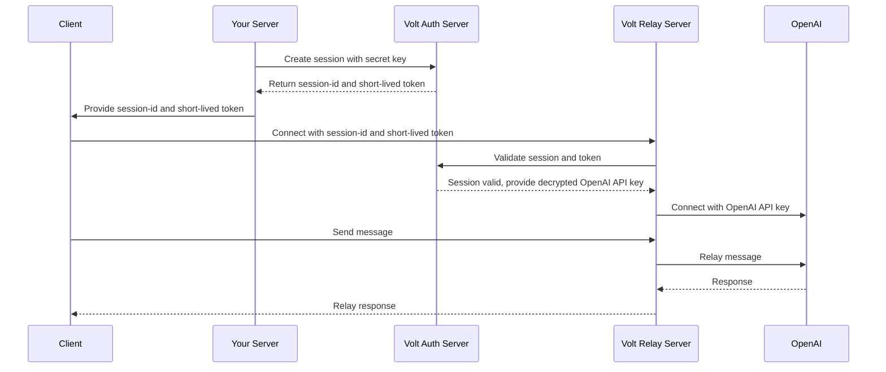

<Frame caption="just having some fun with some midjourney images!">
  
</Frame>

<Note>
 going to be using `openai` instead of `voice ai provider`, if yo have some other provider it should work the same more or less
</Note>

proxy modes are how you relay your `wss` (or `webrtc` in the future) connection between your `client` and your `voice ai provider`.

by your client, i generally mean your `browser` or `mobile` app.

<Info>
 if you are using a server to make calls, directly then you can skip this section.
</Info>

## default proxy mode (in-secure)

here your `client` -> `volt relay` -> `openai`, where `volt` directly forwards all your authentication headers to `openai`.

this means your `openai-api-key` is exposed to both your `client` and to `volt`.

this is super straight forward and easy to setup, but it is not recommended for production use.

here is an example of what this looks like:

## secure session proxy (draft)

<Note>this is not available yet, will be coming soon</Note>

explaing on that, i wouldn't use the word RFC cause not that big a company but you can think of this as a draft of what this might look like

here you would imagine something like the following:

- you store your `openai-api-key` in the `volt` dashboard, and get a secret key for this. the api key can only be decrypted with said `secret-key`
- your `server` creates a session with `volt auth server` with said `secret-key`, returns a `session-id` and a short lived token
- your `client` uses the `session-id` and `short-lived-token` to connect to `volt relay server`
- `volt relay server` connects to `openai` using the `openai-api-key`

would love thoughts on this specifically, please reach out [@cryogenicplanet](https://twitter.com/cryogenicplanet)